I am Oriol, a creative at heart, on a mission to solve problems through value generators at scale, enabling and delivering positive asymmetric impact for all.

I grew up making games, which explains why I study both Math Engineering and Computer Science at UPF. Now I build software, starting with an awarded EdTech app: Mety AI.

<table>
    <tr>
        <td colspan="3"><strong>Apps</strong></td>
    </tr>
    <tr>
        <td>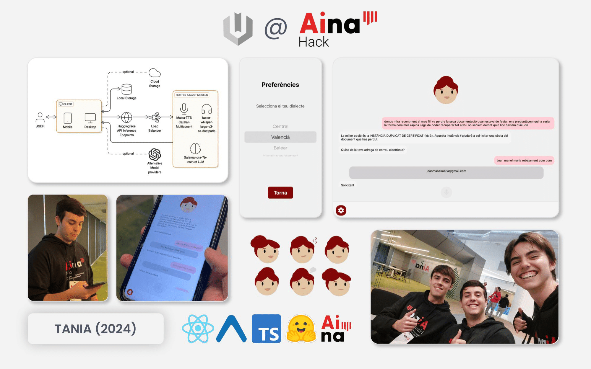</td>
        <td>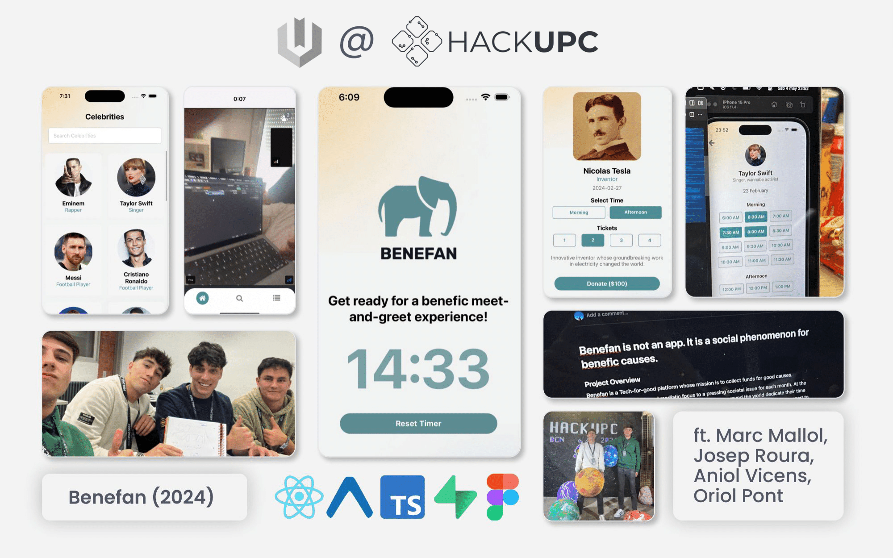</td>
        <td>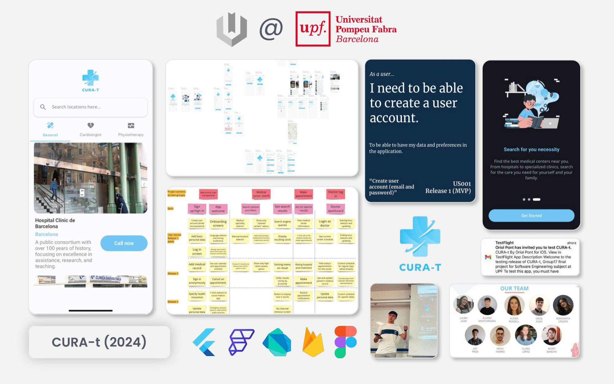</td>
        </tr>
        <tr>
        <td>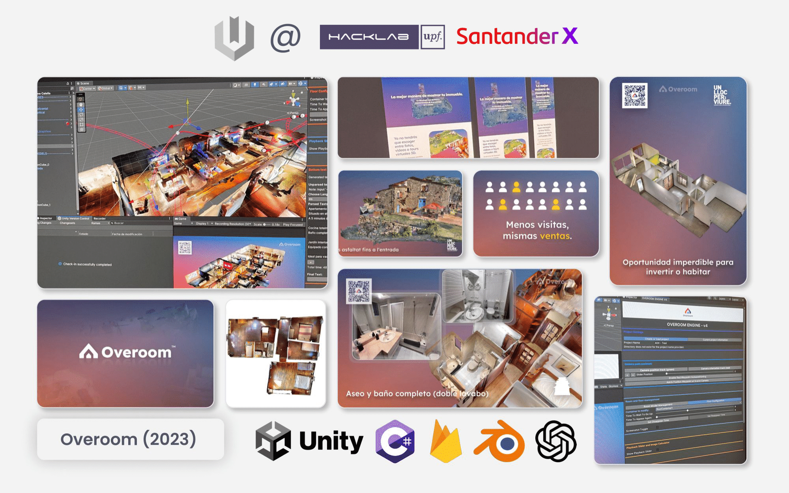</td>
        <td>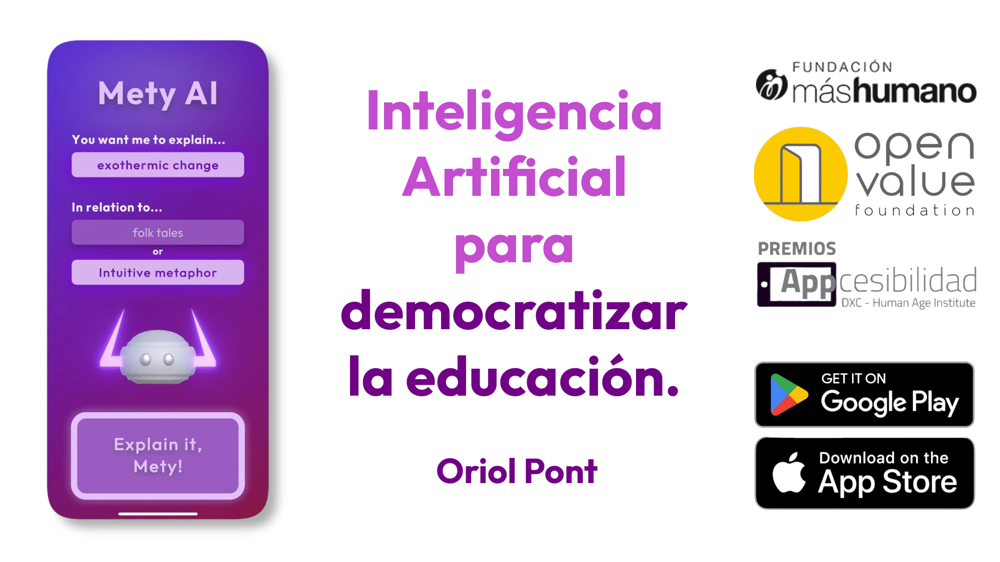</td>
        <td>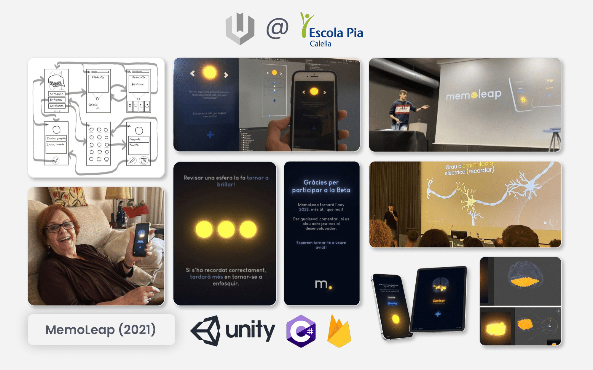</td>
        </tr>
        <tr>
        <td colspan="3"><strong>Games</strong></td>
        </tr>
        <tr>
        <td>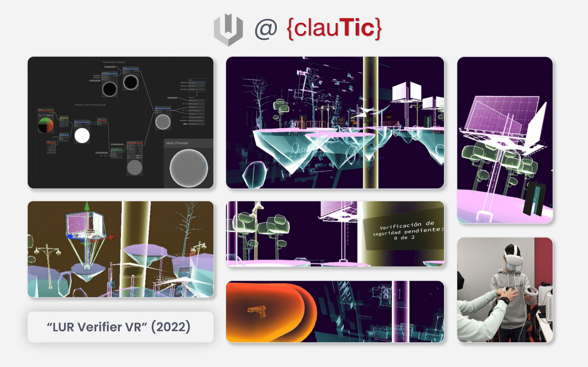</td>
        <td>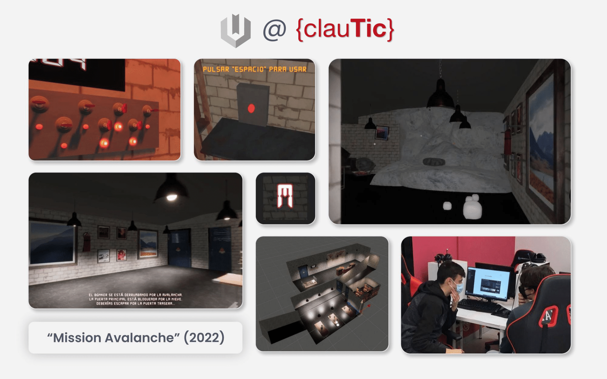</td>
        <td>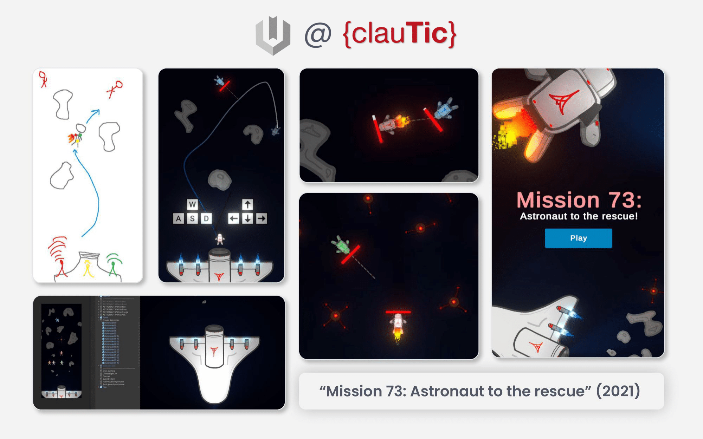</td>
        </tr>
        <tr>
        <td>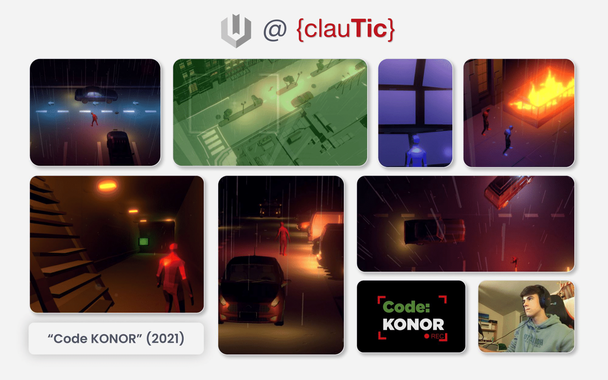</td>
        <td>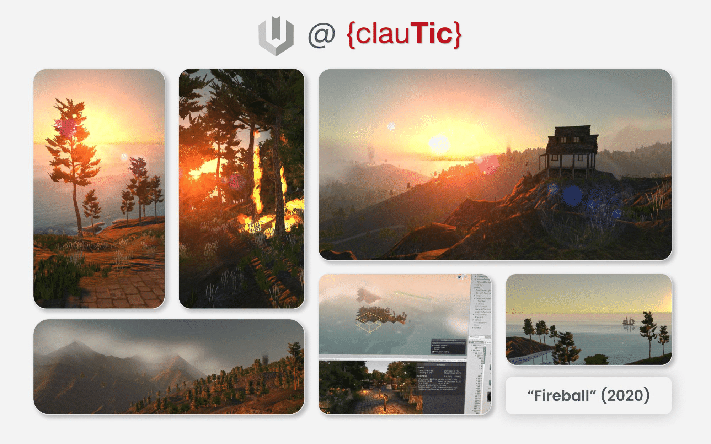</td>
        <td>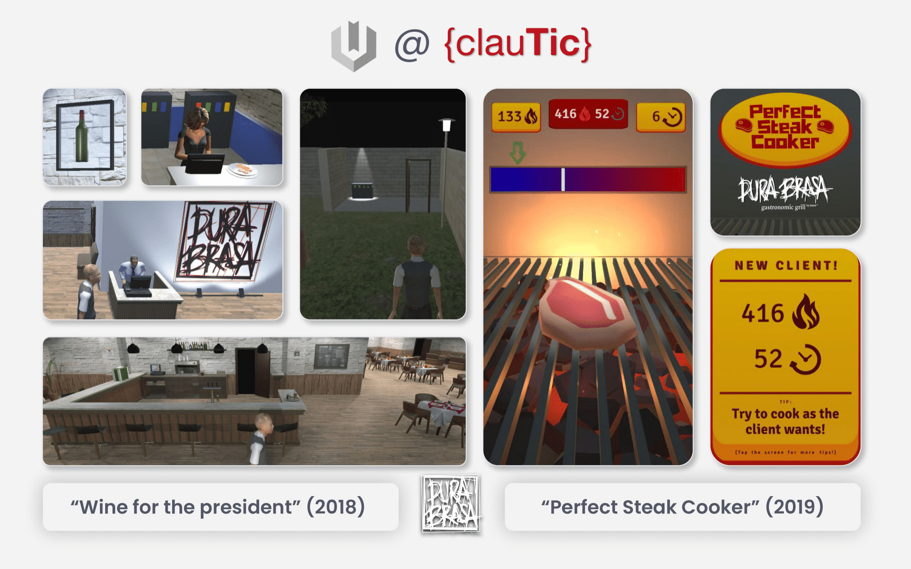</td>
    </tr>
</table>
