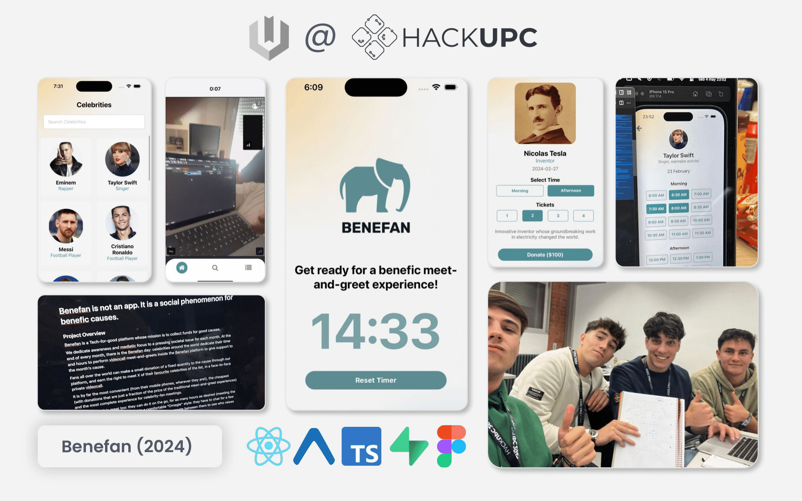

*I am Oriol, a creative at heart, on a mission to solve problems through value generators at scale, enabling and delivering positive asymmetric impact for all.*

I grew up making games, which helps explain why I study both Math Engineering and Computer Science at UPF. I've been breadth-exploring software engineering, AI, product development, gamification, OSS, and tech startups for the last few years. I am currently interested in AGI, distributed stateful serverless runtimes, universal interfaces, 3D animation, and full-stack type-first programming.

I haven't done much of what I want to build just yet, but I do have some history of small side projects that have brought me where I am today:

<table>
    <tr>
        <td colspan="6"><strong>Side projects</strong></td>
    </tr>
    <tr>
        <td></td>
        <td></td>
        <td></td>
    </tr>
    <tr>
        <td></td>
        <td></td>
        <td></td>
    </tr>
    <tr>
        <td colspan="3"><strong>Hackathon / Uni projects</strong></td>
    </tr>
    <tr>
        <td></td>
        <td></td>
        <td></td>
    </tr>
    <tr>
        <td></td>
        <td></td>
        <td></td>
    </tr>
    <tr>
        <td colspan="3"><strong>Games</strong></td>
    </tr>
    <tr>
        <td></td>
        <td></td>
        <td></td>
    </tr>
    <tr>
        <td></td>
        <td></td>
        <td></td>
    </tr>
</table>