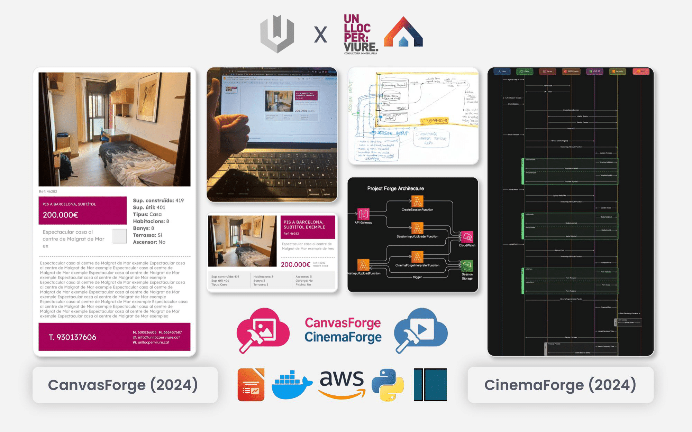
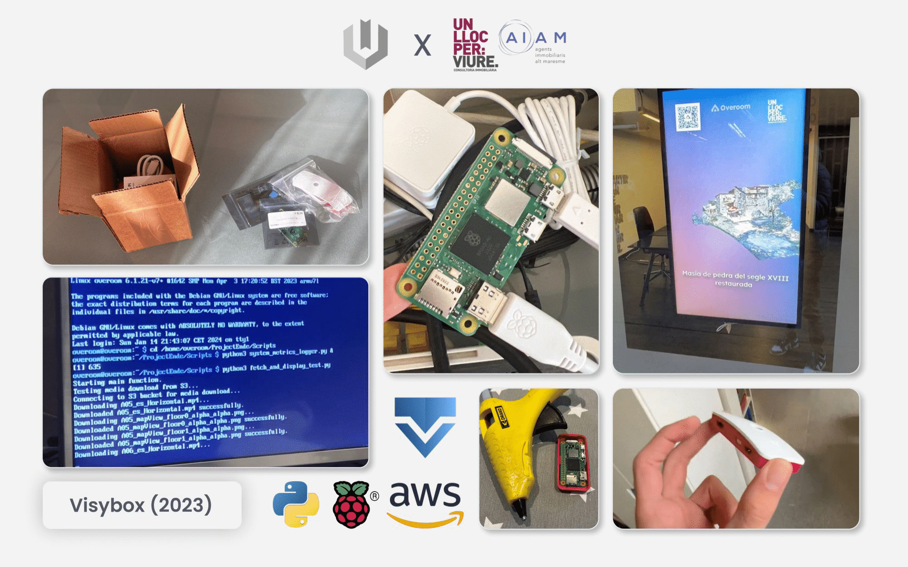
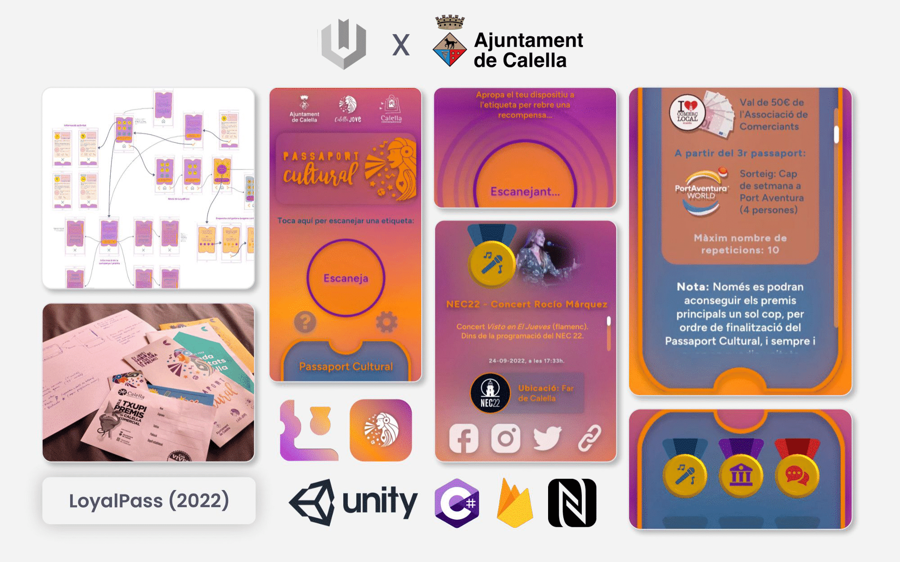
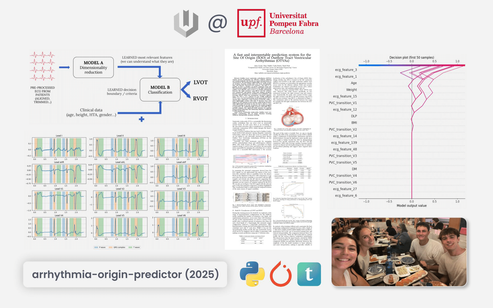
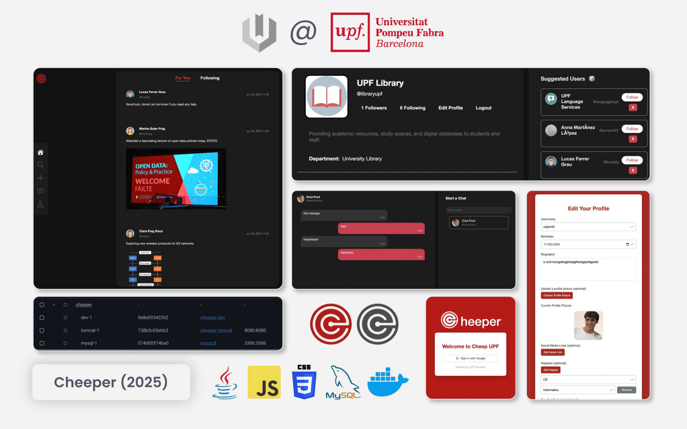
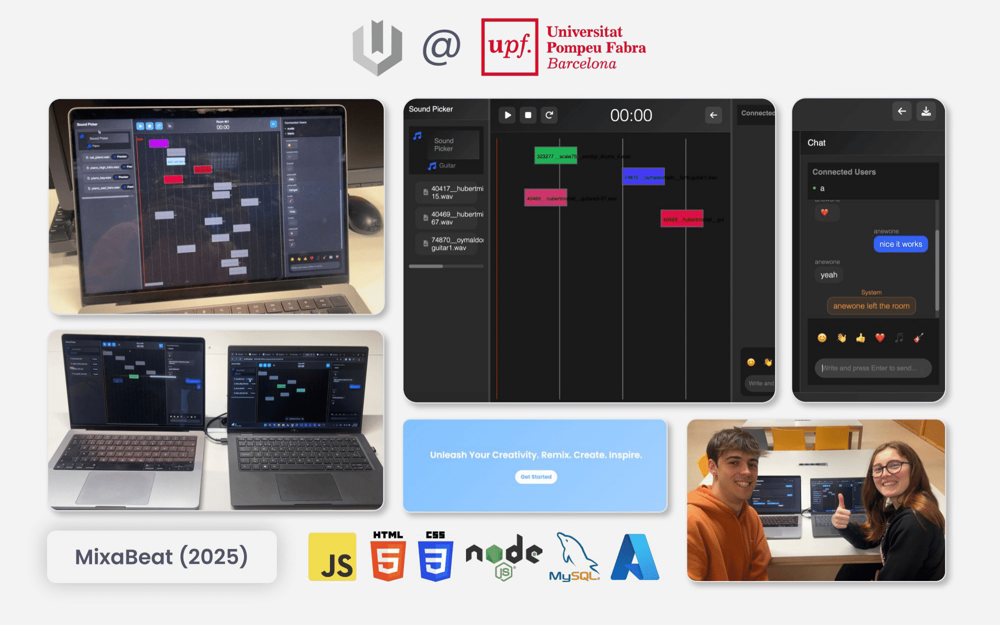

Quick overview of things I built while studying. A few notes on them are available in my [Linkedin profile](https://www.linkedin.com/in/uripont/details/projects/), but I am always happy to yap about the details of any of them if you are interested.

<table>
    <tr>
        <td colspan="6"><strong>Side projects</strong></td>
    </tr>
    <tr>
        <td></td>
        <td></td>
        <td></td>
    </tr>
    <tr>
        <td></td>
        <td></td>
        <td></td>
    </tr>
    <tr>
        <td colspan="3"><strong>Hackathon / Uni projects</strong></td>
    </tr>
    <tr>
        <td></td>
        <td></td>
        <td></td>
    </tr>
    <tr>
        <td></td>
        <td></td>
        <td></td>
    </tr>
    <tr>
        <td colspan="3"><strong>Games</strong></td>
    </tr>
    <tr>
        <td></td>
        <td></td>
        <td></td>
    </tr>
    <tr>
        <td></td>
        <td></td>
        <td></td>
    </tr>
</table>